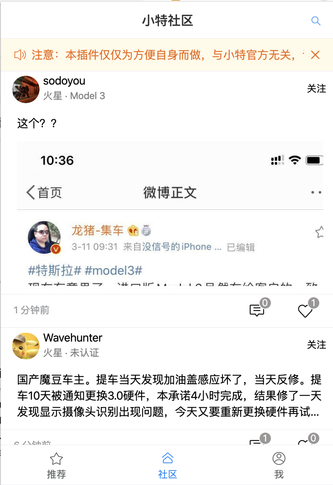

# 小特社区 Chrome 插件版

小特社区 Chrome 插件版本，摸鱼等爱车！

> 本插件纯属个人爱好，与小特官方无关，内容版权归属小特 App 及内容发布者。

## Feature

1. Chrome 插件版本，一点即用，不用频繁刷手机，摸鱼神器！
2. 帖子更新自动通知，不错过最新消息！
3. 下方导航按钮支持双击操作，快速回到顶部并刷新。

## 插个广告

使用我的 Tesla 推荐码购买车辆，你和我都会获得 1500KM 的免费超充额度！

[点击推荐链接购买](https://ts.la/lnanddj59482)

## 安装

### 1. Zip 包安装
请前往 Release 下载最新的 zip 包，安装方式同 Build -> 3 。
> 目前插件还未上传商店，所以推荐此方法安装。

### 2. Crx 安装
下载 请前往 Release 下载最新的 crx 包，进入浏览器扩展程序界面，直接鼠标/触摸板拖入 。

## 操作相关

1. 双击【推荐】、【社区】按钮，快速回到顶部并刷新；
2. 安装鼠标/触摸板在列表页面下拉，刷新本页面；
3. 按下键盘【Esc】键，回到上一页 / 关闭图片预览；
4. 按下【Ctrl+W】(windows) 或者 【Command+W】(Mac) 关闭页面；
5. 点击图片，可以放大预览。
 
## Build

1. 安装依赖
```shell
yarn
```

2. Build
```shell
yarn build

# 需要打包 zip
yarn build-zip
```

3. 安装

Chrome 设置 -> 更多工具 -> 扩展程序, 打开开发者模式，点击加载已解压的扩展程序

> 只支持 Chrome 浏览器，请使用最新版本，其余不知道能不能用。


## 截图




